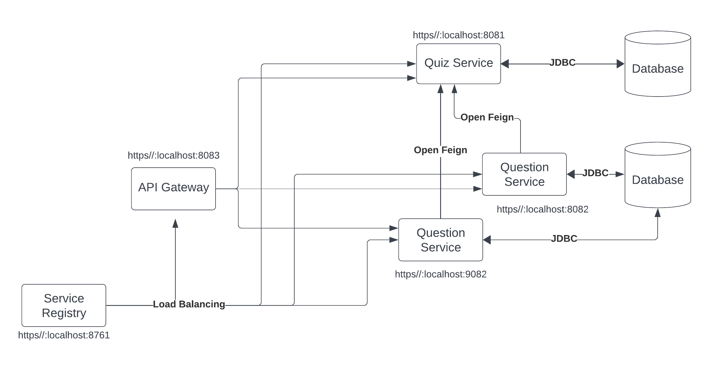

# micro_yt Project

The `micro_yt` project is a microservices-based application built using Spring Boot. It consists of two primary services: the Quiz Service and the Question Service. An API Gateway handles routing client requests to the appropriate services. This project leverages service discovery, load balancing, and inter-service communication using OpenFeign.

## Architecture Overview



### Services

1. **Quiz Service**
    - **Port:** 8081
    - **Description:** Manages quiz-related operations and communicates with the Question Service to fetch quiz questions.
    - **Database:** Connected via JDBC using JPA and MySQL Connector J.

2. **Question Service**
    - **Ports:** 8082
    - **Description:** Manages question-related operations and provides question data to the Quiz Service.
    - **Database:** Connected via JDBC using JPA and MySQL Connector J.

3. **API Gateway**
    - **Port:** 8083
    - **Description:** Handles incoming client requests and routes them to the appropriate service. Implements load balancing for the Question Service using Spring Cloud Gateway MVC.
    - **Routing Configuration:**
        ```properties
        spring.application.name=ApiGateway

        server.port=8083

        # Routes configuration
        spring.cloud.gateway.mvc.routes[0].id=QuizService
        spring.cloud.gateway.mvc.routes[0].uri=lb://QuizService
        spring.cloud.gateway.mvc.routes[0].predicates[0]=Path=/quiz/**

        spring.cloud.gateway.mvc.routes[1].id=QuestionService
        spring.cloud.gateway.mvc.routes[1].uri=lb://QuestionService
        spring.cloud.gateway.mvc.routes[1].predicates[0]=Path=/question/**
        ```

4. **Service Registry**
    - **Port:** 8761
    - **Description:** Service discovery server using Netflix Eureka Server that keeps track of all running instances of services for load balancing and failover.

## Technologies Used

- Spring Boot
- Spring Cloud (Netflix Eureka Server and Client, OpenFeign)
- Spring Cloud Gateway MVC
- JPA
- MySQL Connector J
- Docker (optional, for containerization)

## Prerequisites

- Java 17
- Maven
- MySQL or any other relational database
- Docker (if using containerization)

## Getting Started

### Setting up the Database

1. Create two databases, one for the Quiz Service and one for the Question Service.
2. Update the `application.properties` or `application.yml` files in the respective services with your database configurations.

### Running the Services

1. **Service Registry**
    ```bash
    cd service-registry
    ./mvnw spring-boot:run
    ```

2. **Quiz Service**
    ```bash
    cd quiz-service
    ./mvnw spring-boot:run
    ```

3. **Question Service**
    ```bash
    cd question-service
    ./mvnw spring-boot:run
    ```

4. **API Gateway**
    ```bash
    cd api-gateway
    ./mvnw spring-boot:run
    ```

### Accessing the Services

- **Quiz Service:** `http://localhost:8081`
- **Question Service:** `http://localhost:8082`
- **API Gateway:** `http://localhost:8083`
- **Service Registry Dashboard:** `http://localhost:8761`

## Inter-Service Communication

The Quiz Service communicates with the Question Service using OpenFeign, a declarative HTTP client. This allows for easy and clean REST client creation. The Quiz Service also uses a load balancer to balance workloads between multiple instances of the Question Service.

## Load Balancing

The API Gateway uses the Service Registry to discover instances of the Question Service and load balances the requests between them.

## HTTP Requests

### Quiz Service

1. **Create a Quiz**
    - **Method:** POST
    - **URL:** `http://localhost:8081/quiz`
    - **Body:**
      ```json
      {
          "title": "Java Networking Quiz"
      }
      ```

2. **Get All Quizzes**
    - **Method:** GET
    - **URL:** `http://localhost:8081/quiz`

### Question Service

1. **Create a Question**
    - **Method:** POST
    - **URL:** `http://localhost:8082/question`
    - **Body:**
      ```json
      {
          "question": "What is Java Networking?",
          "quizId": 4
      }
      ```

2. **Get All Questions**
    - **Method:** GET
    - **URL:** `http://localhost:8082/question`

3. **Get a Question by ID**
    - **Method:** GET
    - **URL:** `http://localhost:8082/question/{id}`

4. **Get Questions by Quiz ID**
    - **Method:** GET
    - **URL:** `http://localhost:8082/question/quiz/{quizId}`

### API Gateway

1. **Get All Quizzes (Through Gateway)**
    - **Method:** GET
    - **URL:** `http://localhost:8083/quiz`

## Contributing

1. Fork the repository.
2. Create a feature branch.
3. Commit your changes.
4. Push to the branch.
5. Open a pull request.

## License

This project is licensed under the MIT License. See the [LICENSE](LICENSE) file for details.

## Contact

For any inquiries or issues, please contact [prabeshkunwar12@gmail.com](prabeshkunwar12@gmail.com).

## Project Link

The project is hosted on GitHub at [micro_yt](https://github.com/prabeshkunwar12/micro_yt).
